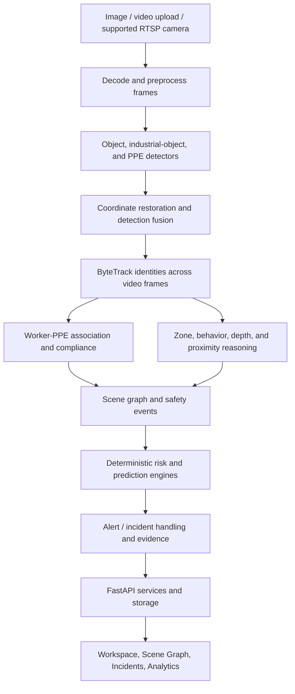

# IntelliWatch Hackathon Guide

This guide is a detailed, technically honest overview of IntelliWatch for demos, judging panels, technical interviews, and team handoffs. It describes the core application in `UI/` and `CuriousPARC/IntelliWatch/`.

> **Demo discipline:** IntelliWatch is a decision-support system. It reports what its vision models and deterministic reasoning pipeline infer from visible media. It does not guarantee that every hazard is detected, replace a trained safety officer, or certify regulatory compliance.

## 1. The project in one sentence

**IntelliWatch turns industrial images, video, and supported camera streams into traceable safety observations: who is present, what protective equipment is visible, where workers are relative to configured hazards, and which observations may need an operator’s attention.**

## 2. The problem and the users

Factories, warehouses, construction areas, and logistics yards generate large amounts of CCTV footage. Conventional CCTV records events but depends on people watching screens continuously or reviewing footage after something has happened. That makes it difficult to notice PPE violations, access to hazardous areas, falls, or dangerous worker–machine proximity in time.

IntelliWatch is designed for:

- **Safety operators**, who need a focused alert queue and evidence to inspect.
- **Safety managers**, who need incident context, trends, and zone configuration.
- **Administrators**, who manage access, cameras, and system configuration.
- **Viewers and investigators**, who need to inspect observations without changing system state.

The product goal is to help people prioritize review and preserve useful evidence, rather than to automate disciplinary or employment decisions.

## 3. Short pitches

### 15-second version

> IntelliWatch is an industrial safety computer-vision platform. It analyzes images, recorded video, and supported CCTV streams for workers, PPE, restricted-zone events, and other hazards, then presents the findings with visual evidence and an explainable incident workflow.

### 60-second version

> Most CCTV systems are passive: they record, but a person has to notice and interpret safety events. IntelliWatch adds a local computer-vision and reasoning pipeline to that workflow. It detects and tracks workers, runs a dedicated PPE detector, associates equipment with the right person, checks configured image-space safety zones, and uses temporal behavior and spatial context to identify events for review. A deterministic risk engine and alert lifecycle turn observations into actionable records with timestamps and image evidence. Operators inspect the result in a browser workspace, incident queue, analytics page, or scene graph. The system is designed to be explainable and to support human review; model output is evidence, not a safety guarantee.

## 4. What makes the project distinctive

- **It connects perception to an operator workflow.** A detection can become a worker PPE assessment, a scene relationship, a risk event, and an alert record with evidence.
- **It separates perception from reasoning.** Neural models detect visual objects; geometric, temporal, and rule-based modules interpret their relationships.
- **It is designed for explainability.** Pixel boxes, track identifiers, PPE state, zone context, event explanations, timelines, and evidence are exposed instead of presenting only an opaque “AI score.”
- **It supports both still and temporal media.** Images give a single-frame assessment; videos and streams provide observations over time and allow tracking and temporal confirmation.
- **It can run locally.** The core backend and inference stack are Python-based and can use locally available model weights and hardware. Device selection includes a CPU fallback.
- **It includes an operator-facing product.** The project has a responsive frontend, not only model scripts or an API demo.

## 5. Technology stack

| Area | Technology | Role |
|---|---|---|
| Backend language | Python | Inference orchestration, safety logic, APIs, and persistence |
| API framework | FastAPI | HTTP API, upload handling, streaming endpoints, and OpenAPI documentation |
| API server | Uvicorn | Runs the ASGI application |
| Data validation | Pydantic and pydantic-settings | Validates requests/results and loads typed configuration |
| Computer vision | OpenCV and NumPy | Image/video decoding, frame manipulation, geometry, and drawing |
| Deep learning runtime | PyTorch and Ultralytics | Runs YOLO-family model inference |
| Person/object detection | YOLO11 Nano by default, configurable | General scene and worker detection |
| Industrial object detection | YOLOv8s-World-v2 by default, configurable | Open-vocabulary industrial object classes such as machinery, forklifts, conveyors, pallets, and barriers |
| PPE detection | Specialized SafetyVision YOLOv8 Nano checkpoint by default, configurable | PPE and some negative PPE indicator classes |
| Multi-object tracking | ByteTrack implementation | Links detections between frames and maintains temporary track IDs |
| Frontend | HTML5, CSS3, and browser JavaScript ES modules | Responsive operator experience; no frontend build framework is required |
| Browser graphics | SVG and HTML Canvas APIs | Scene graph visualization, image overlays, zone editing, and small charts |
| Operational persistence | SQLite and local filesystem | Alert lifecycle/audit data and visual evidence |
| Configuration persistence | JSON and environment settings | Safety-zone configuration and runtime settings |
| Automated checks | pytest and HTTPX | Unit, API, pipeline, and contract checks in the backend repository |

Python package minimum versions are declared in `CuriousPARC/IntelliWatch/requirements.txt`. Model checkpoint files are external local assets and may not be present in every checkout. The actual active device and models should be checked at runtime through the system diagnostics endpoints; the interface saying “CUDA” is not by itself proof that GPU kernels are executing.

### Is an LLM used?

The core safety reasoning and incident explanations are deterministic Python logic; the project does not need a generative language model to decide whether a PPE item was detected or to produce its structured event explanation. This helps keep the explanation traceable to data, but it also means the reasoning is limited to the implemented rules and model outputs.

## 6. Architecture at a glance



### Main code areas

| Path | Responsibility |
|---|---|
| `UI/` | Current browser interface, client API services, and standalone static server |
| `CuriousPARC/IntelliWatch/backend/api/` | FastAPI route handlers, authentication routes, and request dependencies |
| `CuriousPARC/IntelliWatch/backend/schemas/` | Typed request and response contracts for detections, PPE, scenes, incidents, cameras, and more |
| `CuriousPARC/IntelliWatch/backend/services/` | Upload jobs, camera management, scene/risk stores, alert and incident services, authentication, zones, and explanations |
| `CuriousPARC/IntelliWatch/vision/` | Frame decoding/preprocessing, detectors, tracking, streaming, depth, and visualization |
| `CuriousPARC/IntelliWatch/intelligence/` | PPE compliance, zones, behavior, scene graphs, risk, prediction, event, and alert reasoning |
| `CuriousPARC/IntelliWatch/configs/` | Environment-backed model and safety settings |
| `CuriousPARC/IntelliWatch/tests/` | Backend tests covering API contracts and core modules |
| `CuriousPARC/IntelliWatch/reports/` | Generated evaluation and benchmark reports, when present |

There are older/adjacent frontend assets in the backend tree for compatibility. In this workspace, `backend/main.py` selects the top-level `UI/` directory when it exists and serves that interface alongside the API.

## 7. The processing pipeline, step by step

### 7.1 Input and decoding

The application accepts uploaded still images and video files. The backend also has camera APIs and RTSP stream readers. Images are analyzed synchronously; video uploads are submitted as jobs, then clients poll status and retrieve the final result. Video processing samples or processes frames according to runtime settings.

OpenCV decodes frames. The preprocessing layer normalizes model input while keeping metadata about the original dimensions and any resizing/padding. This metadata is needed to put model coordinates back into the original image.

### 7.2 Detection

An object detector predicts classes and bounding boxes for a frame. A detection is not a complete safety conclusion: it says that a model found a visual pattern resembling a class in a part of the frame.

Each result can include:

- A class label, such as `person`, `forklift`, or `Hardhat`.
- A confidence value between 0 and 1. Confidence is a model score, not a calibrated probability that an event is true.
- A bounding box `(x1, y1, x2, y2)` in original-image pixel coordinates.
- Frame and timestamp information for video observations.

The general detector, industrial detector, and PPE detector are separate/configurable components. An industrial model vocabulary is configured for objects including forklifts, industrial vehicles, machinery, robotic arms, conveyors, pallets, safety barriers, and electrical cabinets. Actual detected classes depend on which checkpoint is installed, its class vocabulary, scene quality, and settings.

### 7.3 Coordinate mapping

Models commonly resize images before inference. IntelliWatch uses letterbox-style preprocessing to preserve aspect ratio, then removes the padding and reverses the scale transform to map boxes back to the source resolution. This avoids displaying a correct model box in the wrong location after resizing.

### 7.4 Identity tracking

For video and streams, ByteTrack associates per-frame detections into tracks. It uses motion and bounding-box association to keep a temporary ID while an object remains matchable. This lets later modules reason about one worker across several frames rather than treating every frame as a separate person.

Track IDs are not permanent identity or face recognition. Occlusion, camera cuts, crowded scenes, long gaps, or similar-looking nearby objects can cause an ID to disappear or change. IDs are scoped to a processing context/camera, not a person’s real-world identity.

### 7.5 PPE detection, association, and compliance

PPE is handled as a two-part problem:

1. **Detect gear candidates.** A specialized PPE model can identify classes such as hardhats, safety vests, gloves, goggles, masks, harnesses, and configured negative indicators like `NO-Hardhat` or `NO-Gloves`.
2. **Associate a gear detection with a worker.** A geometric association module checks the gear box against a worker box and expected body region. For example, a hardhat should be near the head, a vest near the torso, and goggles near the face. If multiple workers are nearby, spatial evidence is used to choose an association.

This separation matters because detecting a hardhat somewhere in the image does not prove that a particular worker is wearing it. A hardhat on a table should not count as worker PPE.

The PPE compliance engine compares a worker’s evidence with configured required categories. A useful explanation distinguishes:

- **PRESENT:** the pipeline has accepted visual evidence associated with the worker.
- **MISSING:** the pipeline has enough evidence to report a required item absent/violated under its configured logic.
- **UNKNOWN:** available visual evidence cannot resolve the state reliably.

The result is a visual inference, not a guarantee. Small or occluded workers, low resolution, unusual PPE, blur, shadows, model class coverage, and association geometry all affect correctness. The workspace exposes detected and missing PPE to support inspection.

### 7.6 Restricted-zone reasoning

The backend zone engine supports named polygon zones with types/attributes and checks whether a worker’s estimated ground-contact point (typically near the bottom center of a person box) falls inside the polygon. It can track zone occupancy over time, entry confirmation, and dwell duration.

This is **image-space geofencing** unless the camera is separately calibrated and the particular feature explicitly uses calibration. Polygon membership is not the same as knowing a worker’s true floor coordinates in meters. Perspective and camera angle can affect the estimate.

**Important implementation distinction:** there are two restricted-zone flows in the current product:

- Configured backend polygon zones are evaluated by the vision pipeline and can contribute to backend events/alerts.
- The upload form also lets an operator label the uploaded media as containing a restricted zone. The current frontend creates a corresponding local alert when it finds a person in the analysis result. That alert is stored in browser `localStorage`; this selection is not the same as sending a configured polygon to the backend or creating a backend-persisted SQLite alert.

If asked whether the upload toggle creates a permanent server-side incident, answer **not in the current implementation**. Explain the difference between a local upload-context notification and a backend zone event.

### 7.7 Behavior and temporal analysis

Behavior logic uses observations across frames: track positions, movement changes, duration, and available depth/zone context. It can identify configured states or candidate events such as rapid movement, prolonged stationary behavior, and fall-like geometry. Temporal confirmation and state transitions help reduce one-frame flicker.

These are heuristic visual indicators. A “fall-like” event is not a medical diagnosis, and stationary behavior can have many benign explanations. The safest wording is “possible fall-like event detected for operator review,” not “the worker fell.”

### 7.8 Relative depth and spatial relations

The project includes monocular depth estimation for relative scene context. A single RGB camera does not directly provide physical distance. Without suitable calibration and assumptions, depth values should be described as **relative depth cues**, not meters.

The scene-understanding layer combines image-space distance, track movement, zone membership, and optional relative depth checks to reason about relations such as proximity, approach, or separation trend. A relation is only as reliable as the underlying boxes, tracking, and assumptions.

### 7.9 Scene graph

A scene graph is a structured representation of entities and their relationships:

- **Nodes:** people/tracks, PPE, zones, hazards, vehicles, machines, or other detected entities.
- **Edges:** relations such as wearing, inside/occupying a zone, near, approaching, or moving away.
- **Attributes:** confidence, track ID, bounding box, state, time, and other available evidence.

The graph is useful because safety is often relational. “A worker exists” is less actionable than “a tracked worker is associated with a missing PPE item” or “a worker is inside a configured restricted polygon.” The Scene Graph page lets an operator filter entities and relations, switch graph/table views, and inspect selected items.

In a demo, point out that graph edges are not ground truth. They are inferred relations, and should be backed by corresponding detections or rule outputs.

### 7.10 Risk and prediction

The risk engine is deterministic and configurable. It assigns factors to supported events (for example PPE violations, zone intrusion, fall-like events, rapid movement, or worker–vehicle proximity), adds configured scores and multi-factor escalation, then maps the result to a risk tier using configured thresholds.

The numeric score is a **rule-based index**, not a probability of an accident. Because factors can accumulate, the backend aggregate may exceed 100 unless normalized for presentation. The current workspace normalizes/clamps the displayed peak score to a 0–100 range. When asked about a score, explain both its configured rule basis and this presentation normalization.

The prediction module projects short-horizon motion/risk trends from observed tracks. It is an early-warning heuristic, not a guarantee of a future collision or an autonomous intervention.

### 7.11 Events, alerts, and evidence

An event is a structured observation from perception and reasoning. Alert handling adds operator workflow around selected events:

- Severity categories include critical, high, medium, and low.
- Confidence/persistence rules and cooldown/deduplication reduce repeated notifications for one continuing violation.
- Similar continuing violations can update an existing ticket rather than generating one ticket per frame.
- Visual evidence can be saved with bounding boxes and alert metadata.
- Backend alert records have a lifecycle such as `NEW`, `ACKNOWLEDGED`, `RESOLVED`, or `DISMISSED`, with history and operator notes/reasons.

The backend uses SQLite for alert lifecycle data and local files for evidence. The frontend incident workflow can show backend alerts alongside the local upload-context alerts described above; their persistence and source are different.

## 8. Frontend pages and operator workflow

### Workspace

The workspace is the media analysis surface. An operator chooses an image or video, sees a browser preview, selects the upload zone classification, chooses enabled analysis modules, starts inference, and reviews output. The interface presents annotated source evidence, inference summaries, worker/PPE details, risk context, and a restricted-zone notification when applicable.

Image inference returns a single-frame result. Video analysis is asynchronous and reports processing status/progress before the final summary. Detailed video PPE information is tied to the result payload and analyzed frame data; do not assume every video summary is a perfect aggregate of every worker state across every frame unless that field is explicitly present in the returned result.

### Scene Graph

Shows the current scene in graph, split, or table form. Entity filters include people, vehicles, PPE, zones, hazards, and other entities; relationship filters include spatial, temporal, safety/zone, and equipment relations. Selecting an item opens details backed by scene data.

### Incidents

Provides an operator view of alert records, including severity, status, category, timestamp, and evidence where available. Backend lifecycle controls support review, acknowledgement, resolution, and dismissal. Some upload-context restricted-zone notices are browser-local and are labeled/handled separately from persistent backend alerts.

### Analytics

Summarizes available incident, severity, PPE, zone, and operational metrics. Analytics depend on the data returned by backend services; an empty or disconnected state is not evidence that the facility has no incidents.

### Settings and sources

Settings expose application preferences such as appearance and available configuration. The current sidebar includes Workspace, Scene Graph, Incidents, Analytics, and Settings. There is no dedicated Live Monitoring sidebar item in this UI version, though the source flow and backend still provide camera/RTSP-related capabilities. Camera calibration endpoints exist in the backend, but the calibration controls have been removed from the current Settings interface.

## 9. Backend API and service concepts

FastAPI exposes route families for:

- Health, system metrics, device diagnostics, model evaluation, benchmarks, and configuration.
- Image analysis and asynchronous video job submission, status, result, and media retrieval.
- Current scene and scene graph, risk, current events, predictions, and temporal information.
- Incident listing/detail, explanation, timeline, evidence, and analytics summary.
- Safety-zone CRUD/reload operations.
- Camera registration and lifecycle, camera snapshots/frames/streams, and calibration operations.
- Alert listing, statistics, detail, acknowledgement, resolution, dismissal, and evidence.
- Login/session, user management, permissions, and audit information through authentication routes.

Pydantic schemas define API contracts. The frontend client maps named service operations to `/api/v1/...` routes and normalizes URLs/results for display. This helps keep UI code from duplicating route construction and response handling.

## 10. Data storage and privacy

- **Alert lifecycle:** SQLite-backed alert records and lifecycle history.
- **Authentication:** SQLite-backed user/session/audit data, according to the backend auth service.
- **Visual evidence and generated artifacts:** local filesystem paths under the backend data/output directories.
- **Safety zones:** JSON-backed configuration/service persistence.
- **Short-term temporal context:** in-memory track/temporal buffers used during processing.
- **Upload selection and preview:** browser state for the current session; the restricted-zone local-alert list is persisted in browser `localStorage`.

For a deployment, explain where media and evidence reside, who can access them, how long they are retained, and what organizational consent/policy applies. Do not imply cloud retention or a retention policy that has not been configured.

## 11. Security and access control

The backend documents a role-based authorization model with `ADMIN`, `SAFETY_MANAGER`, `OPERATOR`, and `VIEWER` roles. It includes server-side session handling, password hashing, permission checks, optional camera scoping, and audit records for sensitive actions. Camera, alert, evidence, and settings permissions are distinct in the API.

For a public demonstration, use non-production credentials and sample media. Before production deployment, configure explicit CORS origins, secure credentials and secrets, TLS termination, network access controls, evidence retention, backups, and the organization’s privacy policy. A local demo setup is not automatically a production security review.

## 12. Running and demonstrating the system

### Local UI preview

From `UI/`, the documented static frontend command is:

```powershell
python server.py
```

This serves the interface. Backend-dependent analysis and metrics require the FastAPI service to be available as configured by the frontend API client.

### Backend

The backend project includes `scripts/run_server.py` and can also be launched with Uvicorn using its application module. Install dependencies from `CuriousPARC/IntelliWatch/requirements.txt`, ensure model checkpoints are available, configure environment settings, then verify `/api/v1/health` and `/api/v1/model/diagnostics` before demonstrating inference.

Do not promise a universal FPS number. Throughput depends on model weights, frame size, video sampling, CPU/GPU support, and the active environment. Use live telemetry/diagnostics from the actual demo machine.

### Suggested three-minute demo

1. **Problem (20 sec):** Explain why passive CCTV makes continuous safety review difficult.
2. **Upload (30 sec):** Choose a sample image or short video and explain image versus asynchronous video processing.
3. **Evidence (40 sec):** Show annotated detections and the worker PPE breakdown; point to confidence, boxes, and present/missing/unknown interpretation.
4. **Relationships (30 sec):** Open Scene Graph and explain that nodes are entities and edges are inferred relationships.
5. **Alert workflow (30 sec):** Show an incident’s severity, timestamp, evidence, explanation, and lifecycle.
6. **Technical honesty (20 sec):** Clarify that zone polygons are image-space, model output can be uncertain, and the tool supports human review rather than replacing it.

Use media with a known expected result, and process it before the judging session. Keep an alternative still image ready in case video processing or hardware startup takes too long.

## 13. Limitations and responsible claims

These are good answers when judges ask where the system may fail:

- **Small or distant workers:** PPE may occupy too few pixels for reliable detection.
- **Occlusion and crowding:** Parts of a worker or gear may be hidden; association and tracking become harder.
- **Lighting and motion blur:** Affect detector confidence and bounding-box quality.
- **Domain shift:** A model trained on one PPE style, camera angle, or facility may perform differently elsewhere.
- **False positives and false negatives:** Both are possible; threshold tuning alone cannot solve every failure mode.
- **Unknown visual state:** A region that is not sufficiently visible should not be presented as confidently compliant or non-compliant.
- **Track identity changes:** ByteTrack IDs are temporary visual tracks, not verified identities.
- **2D zones:** A polygon on an image is not a metric floor map; camera perspective matters.
- **Monocular depth:** Relative cues are not automatically distances in meters.
- **Prediction:** Short-horizon projection can miss sudden turns, occlusion, or unexpected actions.
- **Scores:** Risk scores summarize configured factors; they are not calibrated accident probabilities.
- **Restricted-zone upload selection:** The manual upload classification creates browser-local alerts; backend polygon zones are the separate persistent analysis mechanism.
- **Human review:** Alerts can be wrong or incomplete. Operators remain responsible for verification and response.

### How to describe model evaluation

The repository contains test suites, evaluation scripts, and generated report files. Quote a precision, recall, FPS, or pass count only after checking the report for the exact model version, dataset split, hardware, and run date being discussed. A result on a small or synthetic dataset is not equivalent to production-facility validation.

## 14. Common judge questions and concise answers

### “What problem are you solving?”

We help safety teams prioritize review of industrial footage by detecting and structuring visible safety signals, then attaching them to an operator workflow with evidence.

### “Why not just use a generic object detector?”

A person detector does not establish whether a person is wearing required PPE, which worker a nearby gear item belongs to, whether a worker entered a configured zone, or whether an event persisted. IntelliWatch combines specialized detection with association, tracking, geometry, temporal logic, and incident handling.

### “How do you know a detected helmet belongs to a worker?”

The PPE association stage compares the gear box with the worker box and the expected anatomical region, then selects the strongest spatial fit. A raw helmet detection elsewhere in the frame is not sufficient evidence of compliance.

### “What happens when PPE is hard to see?”

The system should represent insufficient visual evidence as unknown rather than claim a confident absence or presence. The operator can inspect the source frame, box, and returned state. Visibility and model performance remain limitations.

### “Is this real-time?”

The backend supports camera-stream processing and reports live telemetry. Real-time throughput depends on hardware, model compatibility, frame sampling, and camera configuration. We verify the active device and measured FPS on the demo machine rather than claim one number for every deployment.

### “Does the risk score mean a 70% chance of an accident?”

No. It is a deterministic score from configured safety factors and escalation rules. It is useful for ranking and explanation, not a calibrated probability. The UI presents a normalized 0–100 peak score.

### “Are the safety zones in real-world coordinates?”

The standard zone engine evaluates polygons in image coordinates using a worker ground-contact estimate. That does not give metric coordinates. Calibration APIs exist, but real-world distance claims require suitable calibration and validation.

### “Does the prediction engine guarantee a collision warning?”

No. It estimates short-horizon trajectory or risk trends from observed motion. Sudden movement, poor tracking, or occlusion can invalidate the projection.

### “Does the upload restricted-zone switch save an incident to the server?”

In the current UI it creates a browser-local alert in the workspace and incident view. It is separate from backend configured polygon zones and SQLite-persisted alert lifecycle records. We describe that boundary openly and would connect it to a backend event contract for a fully server-persistent upload workflow.

### “What is novel here?”

The value is the integrated path from detections to person-specific PPE evidence, zone and temporal context, explainable risk, and an incident-review workflow. The product is more than a detector overlay, while remaining explicit about which conclusions are heuristic.

### “How would you scale it?”

We would separate camera ingestion workers from API/UI services, use a job queue and durable event transport for larger deployments, isolate per-camera state, tune frame sampling and model selection to available hardware, and add storage/retention controls. The current code already has modular camera, job, pipeline, and store services, but production-scale orchestration and high availability would need deployment-specific engineering.

### “What would you improve next?”

Priorities include broader site-specific evaluation, confidence calibration, better handling of small/occluded PPE, improved camera calibration and zone authoring, stronger server-side persistence for all upload-context alerts, operator feedback loops, and deployment observability. Each improvement should be validated on representative data before being presented as solved.

## 15. Glossary

| Term | Meaning in IntelliWatch |
|---|---|
| Detection | A model’s class, confidence, and bounding box for one frame |
| Bounding box | Pixel rectangle around a detected object: top-left `(x1, y1)` to bottom-right `(x2, y2)` |
| Confidence | Model score for a detection; not necessarily a calibrated probability |
| IoU | Intersection over Union, a geometric overlap measure used in box matching/suppression |
| NMS | Non-Maximum Suppression; removes duplicate overlapping detector boxes according to configured rules |
| Letterboxing | Resizing a frame while preserving aspect ratio and padding to model input shape |
| Tracking / MOT | Linking detections across frames into temporary object tracks |
| ByteTrack | The multi-object tracking method used to associate boxes across adjacent frames |
| PPE | Personal Protective Equipment such as hardhats, vests, gloves, and goggles |
| PPE association | Linking a detected gear item to the worker it visually fits |
| Geofence / safety zone | A configured polygon or boundary used to reason about occupancy or entry |
| Ground-contact point | Approximate worker foot position, often estimated from the bottom center of a person box |
| Scene graph | A graph of scene entities (nodes) and their relations (edges) |
| Temporal confirmation | Requiring evidence over time before confirming certain events |
| Risk factor | A configured safety condition that contributes to a deterministic risk score |
| Cooldown / deduplication | Rules that prevent one continuing event from creating repeated identical alert tickets |
| Evidence package | Structured incident context and associated visual evidence for later review |
| RBAC | Role-Based Access Control: permissions are determined by a user’s assigned role and scope |

## 16. One-minute technical summary for the team

> The frontend is a vanilla JavaScript/HTML/CSS application served by the FastAPI backend or through its local static server. The backend accepts image uploads synchronously and video uploads as asynchronous jobs. OpenCV decodes and preprocesses frames; configurable Ultralytics YOLO models detect general, industrial, and PPE classes; coordinates are mapped back to source pixels; ByteTrack links detections over time. A geometric association engine links PPE to tracked workers. Zone, behavior, relative-depth, scene-graph, deterministic risk, and prediction modules add context. FastAPI exposes typed Pydantic contracts for analysis, scenes, incidents, alerts, cameras, zones, analytics, diagnostics, and authentication. Alert state is stored in SQLite, while evidence is stored on disk. The browser gives operators a workspace, graph explorer, incident workflow, and analytics view. Scores and predictions are heuristics for review—not probabilities or guarantees—and camera/image quality and model coverage constrain reliability.

